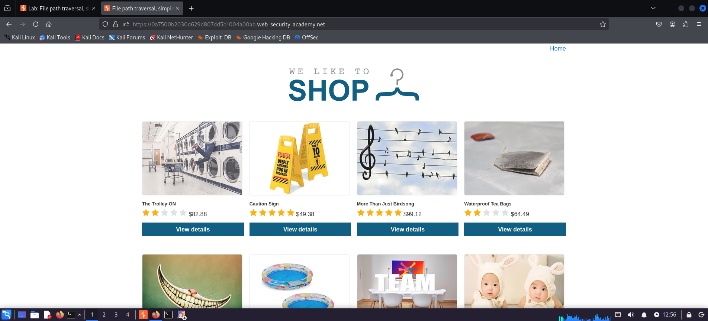
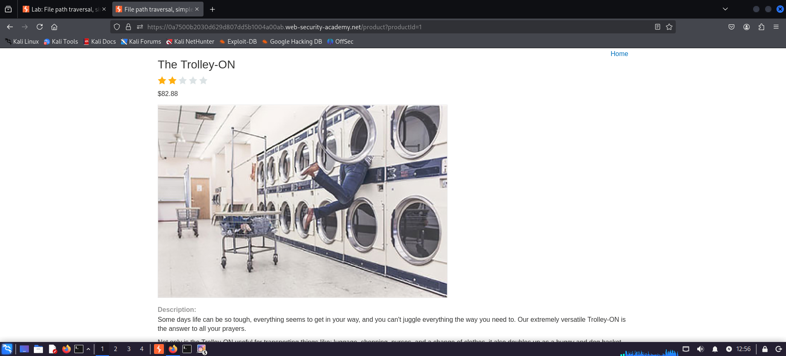
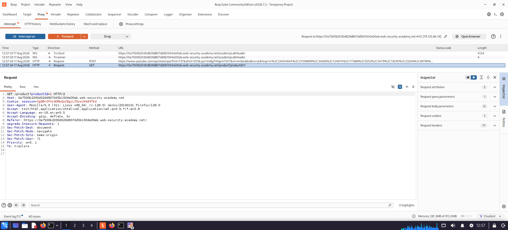
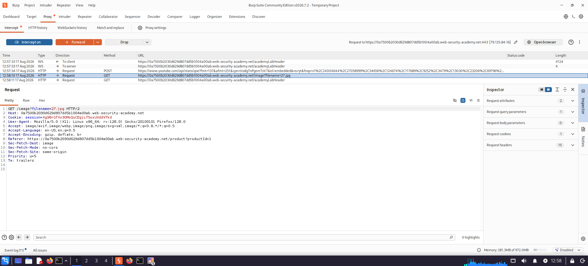
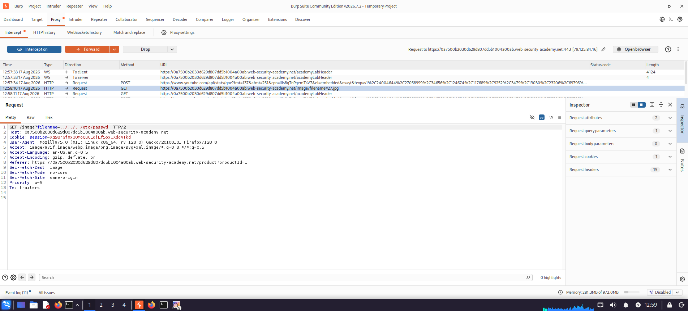
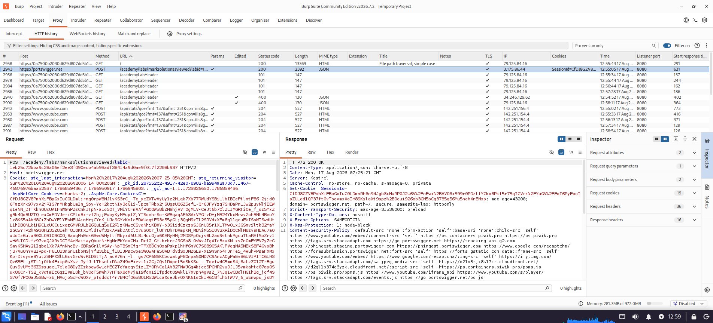
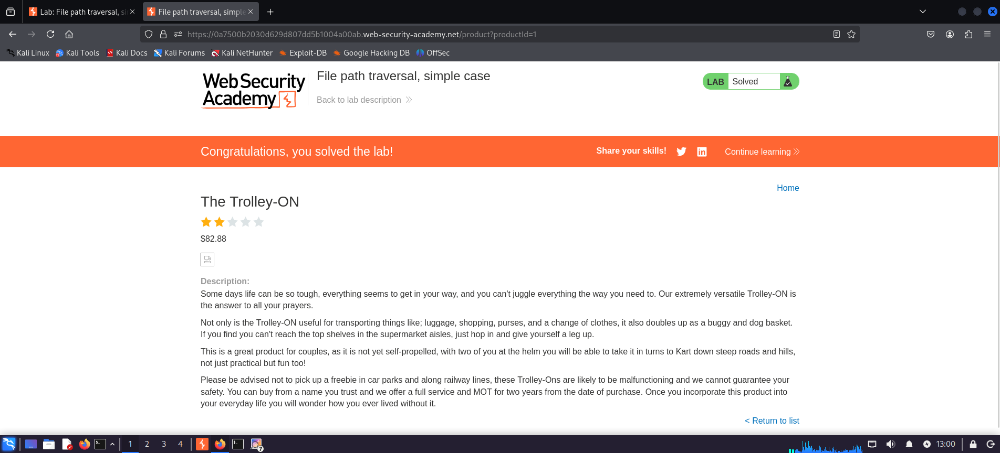

# Path Traversal

## Lab Overview

| Field | Details |
|---|---|
| Platform | PortSwigger Web Security Academy |
| Lab | Path Traversal |
| Vulnerability | Path Traversal / Directory Traversal |
| Difficulty | Apprentice |
| Testing Tool | Burp Suite |
| Status | Completed |

## 1. Objective

The objective of this laboratory exercise was to identify and exploit a **Path Traversal** vulnerability in a web application.

The exercise demonstrates how improper handling of user-controlled file paths can allow an attacker to access files outside the application's intended directory.

The assessment focused on identifying application functionality that accesses files, analyzing the associated HTTP request, identifying the file path parameter, manipulating the file path, testing directory traversal sequences, analyzing the server response, validating unauthorized file access, collecting exploitation evidence, and understanding appropriate defensive measures.

## 2. Vulnerability Description

**Path Traversal**, also known as **Directory Traversal**, is a vulnerability that occurs when an application uses user-controlled input to construct or access filesystem paths without properly restricting the resulting location.

An attacker may manipulate a file path using traversal sequences such as:

```text
../
```

If an application fails to properly validate and restrict the requested path, an attacker may navigate outside the application's intended directory and access unauthorized files.

### Example

A legitimate application request may reference:

```text
/images/product.jpg
```

An attacker may attempt to manipulate the path:

```text
/images/../some-file
```

If the application does not securely validate the resulting path, the server may return an unintended resource.

## 3. Security Classification

| Attribute | Details |
|---|---|
| Vulnerability | Path Traversal |
| CWE | CWE-22 |
| CWE Name | Improper Limitation of a Pathname to a Restricted Directory |
| OWASP Category | A01 – Broken Access Control |
| Severity | High* |
| Attack Vector | Web Application |
| Authentication | Not required in this lab |
| User Interaction | Not required |

*Severity in a real-world environment depends on the files accessible, application privileges, filesystem permissions, and overall system architecture.

## 4. Tools Used

- Burp Suite
- Burp Proxy
- Burp Repeater
- Firefox
- PortSwigger Web Security Academy
- HTTP / HTTPS

## 5. Assessment Methodology

```text
                    Start
                      |
                      v
             Access Application
                      |
                      v
             Review Functionality
                      |
                      v
           Identify File Resource
                      |
                      v
            Observe HTTP Request
                      |
                      v
          Intercept Request in Burp
                      |
                      v
          Identify File Path Input
                      |
                      v
             Modify File Path
                      |
                      v
          Apply Traversal Sequence
                      |
                      v
             Send Request
                      |
                      v
          Analyze HTTP Response
                      |
                      v
        Validate Unauthorized Access
                      |
                      v
            Capture Evidence
                      |
                      v
          Verify Lab Completion
                      |
                      v
                     End
```

## 6. Testing and Exploitation

### 6.1 Access the Application

The intentionally vulnerable web application provided by PortSwigger Web Security Academy was accessed through the browser.

The application was first reviewed under normal conditions to understand its functionality and identify potential resources that could be investigated.

**Evidence:** `L01-E01-Normal-Page.png`



### 6.2 Review the Product Page

The product page was examined to identify resources associated with the displayed product.

**Evidence:** `L01-E02-Product-Page.png`



### 6.3 Intercept the HTTP Request

Burp Suite was used as an interception proxy to capture the application's HTTP request.

The request was analyzed to identify parameters that controlled the requested resource.

**Evidence:** `L01-E03-Product-Request-Burp.png`



### 6.4 Identify the Normal File Path

The original file path used by the application was identified. This established a baseline for understanding the expected resource location before performing path manipulation.

**Evidence:** `L01-E04-Normal-File-Path.png`



### 6.5 Modify the File Path

The file path parameter was manipulated using a Path Traversal sequence.

A common traversal sequence is:

```text
../
```

The modified request was then sent to the application.

**Evidence:** `L01-E05-Change-File-Path.png`



### 6.6 Analyze the Response

The modified request was forwarded to the application and the resulting HTTP response was analyzed.

The response demonstrated that the manipulated path was processed by the application and resulted in access to a resource outside the application's intended path.

**Evidence:** `L01-E06-Change-File-Path-Forward-Response.png`



### 6.7 Verify Lab Completion

After successfully demonstrating the vulnerability, the PortSwigger Web Security Academy laboratory reported successful completion.

**Evidence:** `L01-E07-lab-solved.png`



## 7. Evidence Summary

| Evidence | Description | Purpose |
|---|---|---|
| `L01-E01-Normal-Page.png` | Normal application page | Establish baseline |
| `L01-E02-Product-Page.png` | Product page | Identify application resource |
| `L01-E03-Product-Request-Burp.png` | HTTP request in Burp Suite | Analyze request |
| `L01-E04-Normal-File-Path.png` | Original file path | Establish normal behavior |
| `L01-E05-Change-File-Path.png` | Modified file path | Demonstrate path manipulation |
| `L01-E06-Change-File-Path-Forward-Response.png` | Server response | Validate exploitation |
| `L01-E07-lab-solved.png` | Lab completion | Provide completion proof |

## 8. Vulnerability Impact

A successful Path Traversal vulnerability can allow an attacker to access files outside the application's intended directory.

Potential consequences include:

- Unauthorized file access
- Sensitive information disclosure
- Exposure of configuration files
- Exposure of application source code
- Disclosure of credentials or secrets
- Access to operating-system files
- Disclosure of internal application information
- Potential further compromise of the application or underlying host

### Demonstrated Impact

In this laboratory, the vulnerability was successfully exploited to demonstrate unauthorized access to a file outside the application's intended directory.

## 9. Root Cause Analysis

The root cause is insufficient validation and restriction of user-controlled filesystem paths.

Applications should not trust file paths supplied directly or indirectly by users.

A vulnerable flow can be represented as:

```text
User Input
    |
    v
File Path Parameter
    |
    v
Application
    |
    v
Filesystem
```

If the application does not validate the resulting canonical path, an attacker may manipulate the path:

```text
User Input
    |
    v
Path Traversal Sequence
    |
    v
Unintended Directory
    |
    v
Unauthorized File
```

## 10. Remediation Recommendations

### 10.1 Avoid User-Controlled Filesystem Paths

Applications should avoid allowing users to directly specify filesystem paths. Use controlled resource identifiers instead.

Example:

```text
file_id=123
```

can be mapped internally to a known safe file.

### 10.2 Use an Allowlist

Where possible, applications should use an allowlist of permitted resources rather than accepting arbitrary paths.

### 10.3 Canonicalize the Path

Resolve the canonical filesystem path before accessing the file and verify that it remains inside the intended application directory.

```text
Requested Path
      |
      v
Canonicalize Path
      |
      v
Check Allowed Directory
      |
      +------ Outside Allowed Directory ------> Reject
      |
      v
Inside Allowed Directory
      |
      v
Access Resource
```

### 10.4 Implement Server-Side Validation

All file-related input should be validated on the server. Client-side validation alone is not sufficient.

### 10.5 Apply Least Privilege

The application service account should have only the filesystem permissions required for normal operation.

### 10.6 Separate Sensitive Files

Sensitive configuration files, credentials, source code, and operating-system resources should not be stored in directories accessible by the web application.

### 10.7 Secure Error Handling

Avoid exposing detailed filesystem errors, absolute paths, or internal server information in HTTP responses.

### 10.8 Security Monitoring

Applications should log suspicious file access attempts, including traversal sequences, unexpected paths, and repeated failed access requests.

## 11. OWASP and CWE Mapping

### OWASP Top 10

**A01 – Broken Access Control**

Path Traversal can result in unauthorized access to files or resources that should not be accessible to the requesting user.

### CWE-22

**Improper Limitation of a Pathname to a Restricted Directory ('Path Traversal')**

CWE-22 describes weaknesses where external input is used to construct a pathname without properly restricting the resulting path to an intended directory.

## 12. Detection Indicators

During authorized security testing, potential Path Traversal test inputs may include:

```text
../
..\
%2e%2e%2f
%2e%2e/
..%2f
..%5c
```

The exact behavior depends on URL parsing, encoding, server configuration, and application implementation.

These techniques should only be tested against systems for which explicit authorization has been obtained.

## 13. Defensive Testing Recommendations

Recommended security activities include:

- Manual penetration testing
- Dynamic Application Security Testing (DAST)
- Static Application Security Testing (SAST)
- Secure code review
- Filesystem permission review
- Input validation testing
- Negative testing
- API security testing

Security testing should verify that:

1. Users cannot escape intended directories.
2. Encoded traversal sequences are handled safely.
3. Canonicalization is correctly implemented.
4. Sensitive files cannot be accessed.
5. Application service accounts have restricted filesystem permissions.
6. Error responses do not expose sensitive filesystem information.

## 14. Key Learning Outcomes

This laboratory provided practical experience in identifying and validating Path Traversal vulnerabilities.

### Technical Learnings

- File and resource requests can represent important attack surfaces.
- HTTP requests should be analyzed for user-controlled file parameters.
- Burp Suite can be used to intercept and manipulate application requests.
- User-controlled filesystem paths should not be trusted.
- Path Traversal can result in unauthorized filesystem access.
- Exploitation should be supported by clear and reproducible evidence.

### Security Engineering Learnings

- Input validation must be performed server-side.
- Applications should use controlled resource identifiers.
- Filesystem permissions should follow the principle of least privilege.
- Sensitive files should be isolated from web-accessible directories.
- Security boundaries should be validated through penetration testing.

## 15. Skills Demonstrated

- Web application security testing
- HTTP request analysis
- Burp Suite Proxy
- Burp Suite Repeater
- Parameter manipulation
- Path Traversal testing
- Filesystem access analysis
- Vulnerability validation
- Exploitation evidence collection
- Impact assessment
- Root cause analysis
- Security remediation
- Technical security documentation

## 16. Repository Structure

```text
02-Lab-Path-Traversal/
│
├── README.md
│
└── Evidence/
    ├── L01-E01-Normal-Page.png
    ├── L01-E02-Product-Page.png
    ├── L01-E03-Product-Request-Burp.png
    ├── L01-E04-Normal-File-Path.png
    ├── L01-E05-Change-File-Path.png
    ├── L01-E06-Change-File-Path-Forward-Response.png
    └── L01-E07-lab-solved.png
```

## 17. Lab Completion

**Status: Completed**

The Path Traversal vulnerability was successfully identified, tested, exploited, and validated within the authorized PortSwigger Web Security Academy laboratory environment.

The collected evidence demonstrates the testing process from normal application behavior through successful exploitation and laboratory completion.

## 18. Disclaimer

This security testing activity was performed exclusively against the intentionally vulnerable environment provided by PortSwigger Web Security Academy for educational and authorized security-training purposes.

No unauthorized systems, applications, infrastructure, or third-party services were targeted.

The techniques documented in this repository are intended for authorized security testing, education, and defensive security research only.

---

## Author

**Yashdeep Sankhla**

Cybersecurity | Network Security | Web Application Security

GitHub: [@y4shsec](https://github.com/y4shsec)
