# Broken Access Control – Web Security Labs

## Lab Overview

| Field | Details |
|---|---|
| Platform | PortSwigger Web Security Academy |
| Project Section | Lab 4 |
| Vulnerability Class | Broken Access Control |
| Testing Tool | Burp Suite / Web Browser |
| Exercises | 5 |
| Evidence Screenshots | 28 |
| Status | Completed |

---

## 1. Objective

The objective of this laboratory section was to gain practical experience identifying and validating **Broken Access Control** vulnerabilities in intentionally vulnerable web applications.

The exercises demonstrate how improper authorization enforcement can allow an authenticated or unauthenticated user to access functionality, resources, or privileges that should be restricted.

The assessment focused on:

- Identifying protected application functionality.
- Testing access to administrative endpoints.
- Analyzing URLs and request parameters.
- Inspecting authorization-related cookies.
- Manipulating client-controlled role information.
- Testing privilege escalation.
- Testing access to other users' resources.
- Validating unauthorized administrative actions.
- Collecting technical evidence.
- Understanding appropriate remediation controls.

---

## 2. Vulnerability Description

**Broken Access Control** occurs when an application fails to properly enforce authorization rules for protected resources or actions.

Authentication answers:

> Who is the user?

Authorization answers:

> What is the user allowed to access or perform?

A secure application must enforce authorization decisions on the server side.

Broken access control may allow attackers to:

- Access administrative functionality.
- View or modify resources belonging to other users.
- Change their own privileges.
- Perform unauthorized administrative actions.
- Access restricted endpoints.
- Manipulate authorization-related parameters.
- Escalate from a normal user to an administrator.

---

## 3. Security Classification

| Attribute | Details |
|---|---|
| Vulnerability | Broken Access Control |
| CWE | CWE-284 |
| CWE Name | Improper Access Control |
| OWASP Category | A01 – Broken Access Control |
| Attack Surface | Web Application |
| Testing Method | Authorization and privilege-boundary testing |
| Authentication | Depends on the individual exercise |
| User Interaction | Depends on the individual exercise |

> Severity depends on the protected functionality, affected users, business impact, and level of privilege obtainable through exploitation.

---

## 4. Tools Used

- Burp Suite
- Burp Proxy
- Burp Repeater
- Firefox / Web Browser
- PortSwigger Web Security Academy
- HTTP / HTTPS
- Browser Developer Tools where applicable

---

## 5. Assessment Methodology

The Broken Access Control exercises were approached using a structured authorization-testing workflow.

```text
                    Start
                      |
                      v
             Access Application
                      |
                      v
           Establish Normal User
                      |
                      v
          Identify Protected Resource
                      |
                      v
          Attempt Unauthorized Access
                      |
                      v
            Capture HTTP Request
                      |
                      v
       Identify Authorization Controls
                      |
                      v
      Manipulate URL / Parameter / Cookie
                      |
                      v
           Replay Modified Request
                      |
                      v
          Analyze Server Response
                      |
                      v
        Validate Privilege Escalation
                      |
                      v
             Capture Evidence
                      |
                      v
          Verify Lab Completion
                      |
                      v
                     End
```

---

# 6. Exercises and Evidence

The supplied Lab 4 evidence contains **five Broken Access Control exercises**.

The original evidence filenames are preserved exactly as collected.

---

# Exercise L01 – Unprotected Administrative Functionality

## Vulnerability Focus

**Unprotected administrative functionality**

The objective was to identify an administrative interface that could be accessed without sufficient authorization controls.

## Evidence Available

- `L01-E01-Normal-Page.png`
- `L01-E02-add-robots-txt-URL.png`
- `L01-E03-add-administrator-panel-url-find-target-user(carlos ).png`
- `L01-E04-user(carlos)-deleted-lab-solved.png`

## Testing Process

The application was first reviewed under normal conditions.

The `robots.txt` resource was investigated to identify potentially sensitive or administrative paths exposed by the application.

The discovered administrative panel path was then accessed.

Administrative functionality was used to identify the target user and perform the required lab action.

Successful completion confirmed that the administrative functionality was insufficiently protected.

## Evidence

### Normal Application

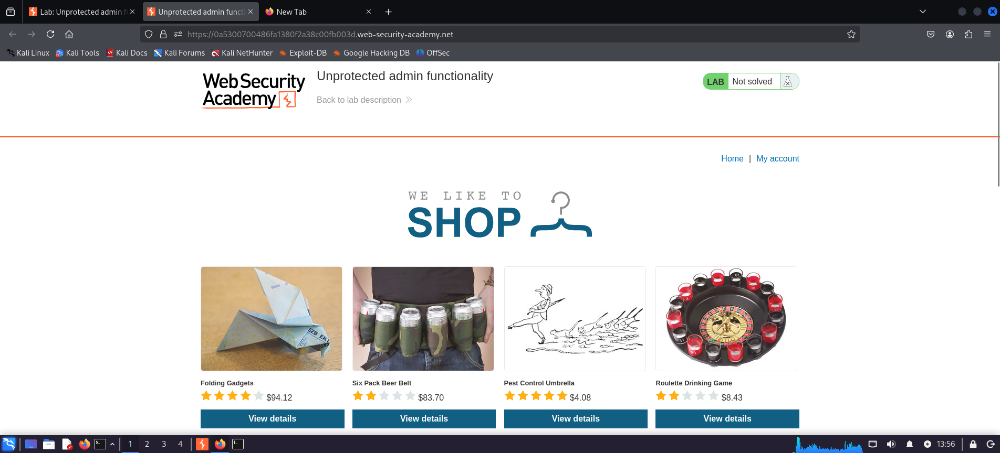

**Evidence:** `L01-E01-Normal-Page.png`

### robots.txt Investigation

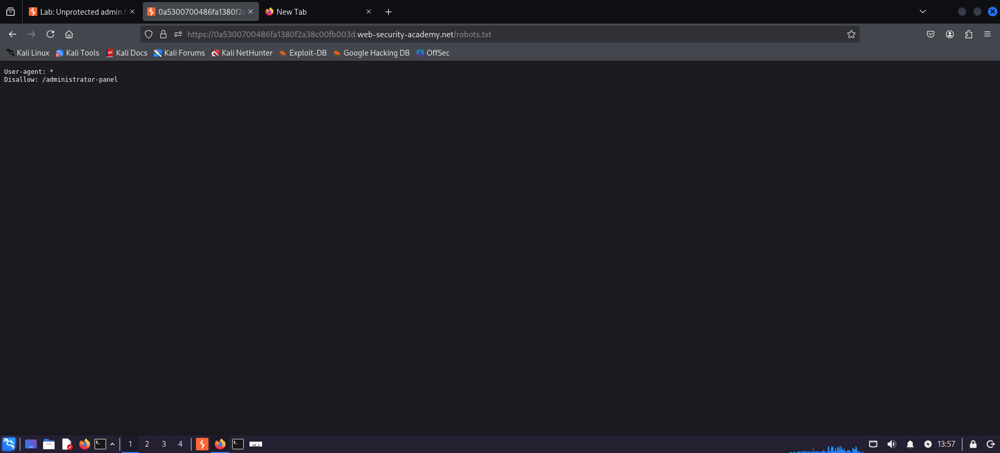

**Evidence:** `L01-E02-add-robots-txt-URL.png`

### Administrative Panel and Target User

.png)

**Evidence:** `L01-E03-add-administrator-panel-url-find-target-user(carlos ).png`

### Lab Completion

-deleted-lab-solved.png)

**Evidence:** `L01-E04-user(carlos)-deleted-lab-solved.png`

---

# Exercise L02 – Unprotected Administrative Functionality with Unpredictable URL

## Vulnerability Focus

**Unprotected administrative functionality with an unpredictable URL**

This exercise demonstrates that an administrative interface may remain vulnerable even when the administrative URL is not obvious.

## Evidence Available

- `L02-E01-Normal-Page.png`
- `L02-E02-find-admin-name.png`
- `L02-E03-load-admin-es8czu.png`
- `L02-E04-user(carlos)-deleted-lab-solved.png`

## Testing Process

The application was reviewed under normal conditions.

Application behavior and available information were analyzed to identify the administrative endpoint.

The discovered administrative path was accessed and the administrative interface was loaded.

The target user was then identified and the required administrative action was performed.

The successful completion of the lab demonstrated that relying on an unpredictable or obscure URL is not an effective authorization control.

## Evidence

### Normal Application

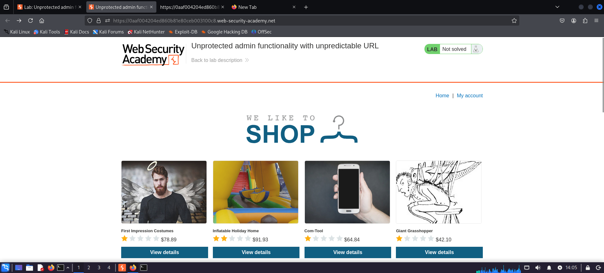

**Evidence:** `L02-E01-Normal-Page.png`

### Administrative Information Discovery

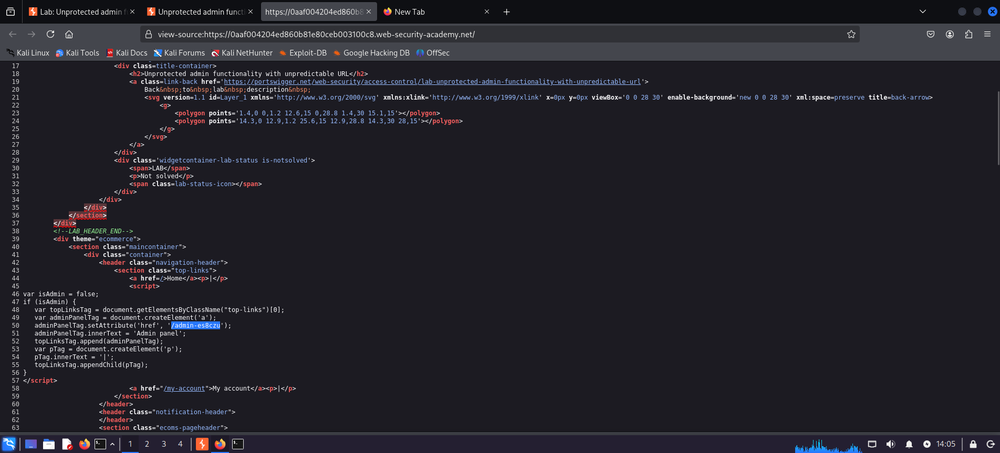

**Evidence:** `L02-E02-find-admin-name.png`

### Administrative Panel

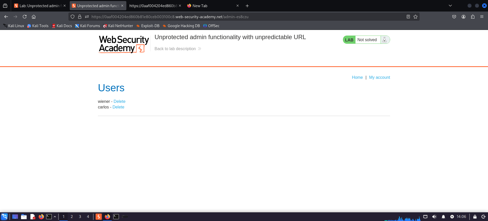

**Evidence:** `L02-E03-load-admin-es8czu.png`

### Lab Completion


**Evidence:** `L02-E04-user(carlos)-deleted-lab-solved.png`

---

# Exercise L03 – User Role Controlled by Request Parameter

## Vulnerability Focus

**Parameter-based privilege escalation**

This exercise demonstrates a critical authorization failure where the application trusts a client-controlled authorization value.

The supplied evidence demonstrates manipulation of the `Admin=false` cookie to `Admin=true`.

## Evidence Available

- `L03-E01-Normal-Page.png`
- `L03-E02-add-admin-url-output.png`
- `L03-E03-try-to-login-via-credentials.png`
- `L03-E04-capture-login-request.png`
- `L03-E05-capture-login-request-change-cookie-Admin=false-to-Admin=true.png`
- `L03-E06-repeater-cookie-change-request-response.png`
- `L03-E07-before-cookie-change-browser-response.png`
- `L03-E08-after-cookie-change-browser-response-found-admin-panel & user(carlos).png`
- `L03-E09-user(carlos)-deleted-lab-solved.png`

## Testing Process

The application was accessed and the normal user behavior was established.

The login request was captured using Burp Suite.

The response was inspected for authorization-related information.

An `Admin=false` cookie was identified as a client-controlled authorization value.

The request was modified so that the value changed from:

```text
Admin=false
```

to:

```text
Admin=true
```

The modified request was replayed.

The application subsequently treated the user as an administrator and exposed the administrative panel.

The administrative functionality was then used to perform the required lab action against the target user.

This demonstrated a **vertical privilege escalation** caused by trusting a client-controlled authorization value.

## Evidence

### Normal Application

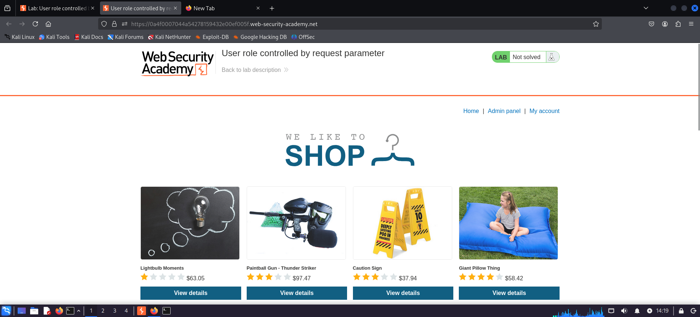

**Evidence:** `L03-E01-Normal-Page.png`

### Administrative URL Test

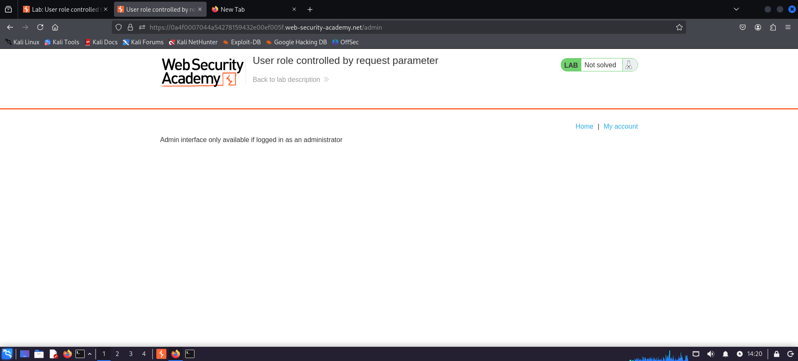

**Evidence:** `L03-E02-add-admin-url-output.png`

### Login Attempt

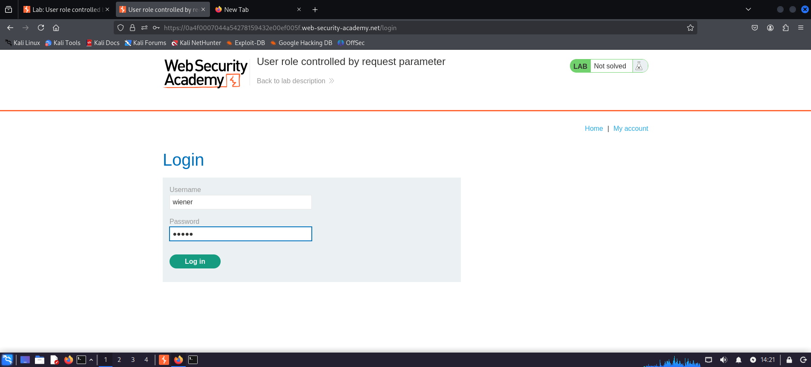

**Evidence:** `L03-E03-try-to-login-via-credentials.png`

### Login Request Captured in Burp

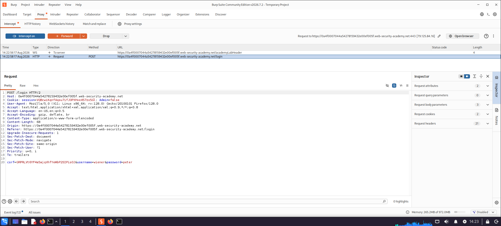

**Evidence:** `L03-E04-capture-login-request.png`

### Authorization Cookie Manipulation

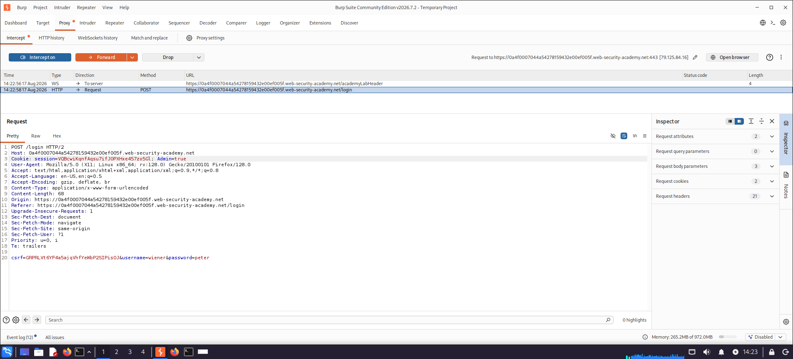

**Evidence:** `L03-E05-capture-login-request-change-cookie-Admin=false-to-Admin=true.png`

### Repeater Response

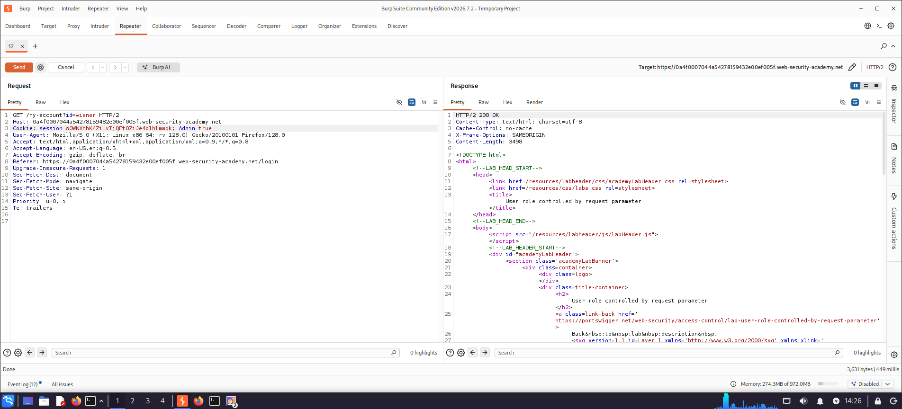

**Evidence:** `L03-E06-repeater-cookie-change-request-response.png`

### Before Cookie Modification

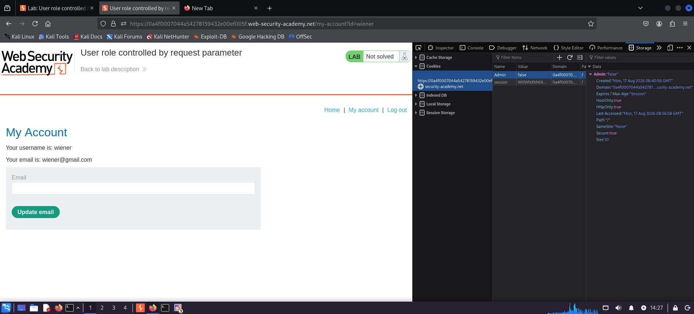

**Evidence:** `L03-E07-before-cookie-change-browser-response.png`

### After Cookie Modification

.png)

**Evidence:** `L03-E08-after-cookie-change-browser-response-found-admin-panel & user(carlos).png`

### Lab Completion

-deleted-lab-solved.png)

**Evidence:** `L03-E09-user(carlos)-deleted-lab-solved.png`

---

# Exercise L04 – User Role Can Be Modified in User Profile

## Vulnerability Focus

**Privilege escalation through user-controlled profile data**

This exercise demonstrates how a user-controlled profile or account parameter can affect authorization if the server does not properly validate privilege-related values.

## Evidence Available

- `L04-E01-Normal-Login-Page.png`
- `L04-E02-capture-login-request.png`
- `L04-E03-update-email.png`
- `L04-E05-repeater-add-role-id-2.png`
- `L04-E06-admin-panel-access.png`
- `L04-E07-user(carlos)-deleted-lab-solved.png`

## Testing Process

The login and normal account functionality were reviewed.

The login request was captured using Burp Suite.

The profile update functionality was investigated.

A role-related parameter was identified during request analysis.

The request was modified in Burp Repeater to test whether the role value could be changed to an administrative role.

The resulting response demonstrated that the application accepted the modified role value.

Administrative functionality subsequently became accessible.

The target user was then deleted to satisfy the laboratory objective.

## Evidence

### Normal Login Page

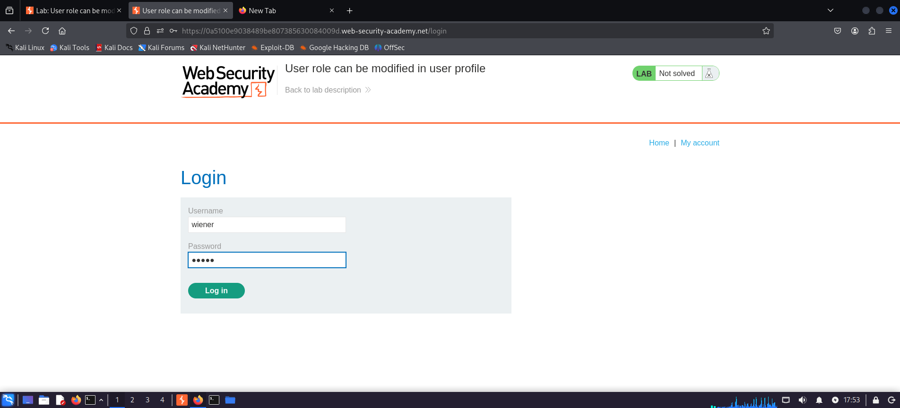

**Evidence:** `L04-E01-Normal-Login-Page.png`

### Login Request

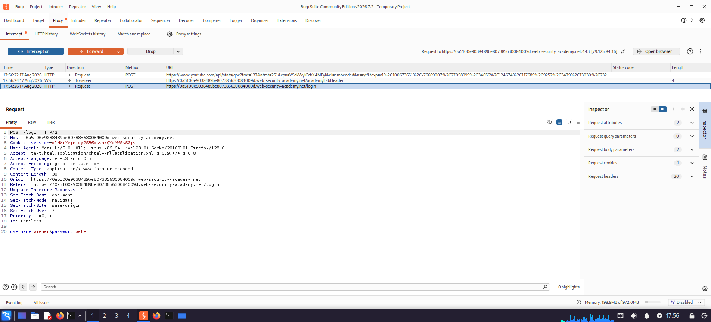

**Evidence:** `L04-E02-capture-login-request.png`

### Profile Update

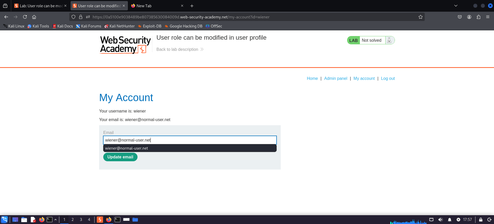

**Evidence:** `L04-E03-update-email.png`

### Modified Role Request

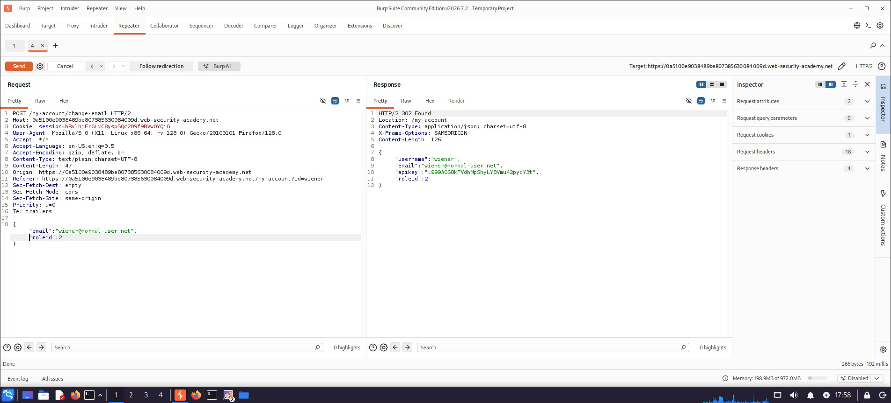

**Evidence:** `L04-E05-repeater-add-role-id-2.png`

### Administrative Panel Access

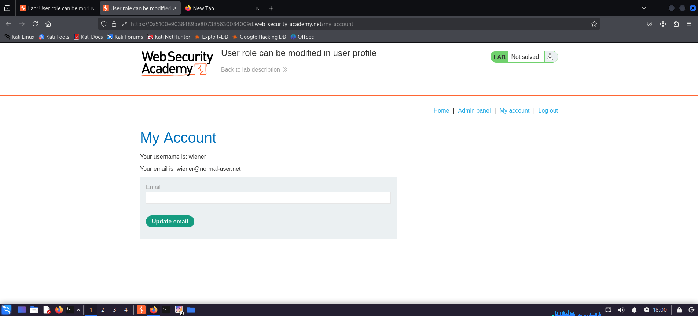

**Evidence:** `L04-E06-admin-panel-access.png`

### Lab Completion

-deleted-lab-solved.png)

**Evidence:** `L04-E07-user(carlos)-deleted-lab-solved.png`

> The original evidence set does not contain an `L04-E04` file. The filename sequence is intentionally preserved as collected.

---

# Exercise L05 – User ID Controlled by Request Parameter

## Vulnerability Focus

**User ID controlled by a request parameter**

This exercise demonstrates an authorization weakness where a user-controlled identifier can be manipulated to access another user's resource.

## Evidence Available

- `L05-E01-user(wiener)-login.png`
- `L05-E02-user(wiener)-burp-request.png`
- `L05-E03-user(carlos)-api-retrieved.png`
- `L05-E04-user(carlos)-api-submitted-lab-solved.png`

## Testing Process

A normal user account was authenticated.

The associated request was captured using Burp Suite.

The request was analyzed to identify the user identifier used to retrieve account information.

The identifier was modified to reference another user.

The modified request returned the other user's API/resource information.

This demonstrated that the application failed to properly enforce authorization over the requested user resource.

The laboratory completion condition was then satisfied.

## Evidence

### Normal User Login

-login.png)

**Evidence:** `L05-E01-user(wiener)-login.png`

### Burp Request

-burp-request.png)

**Evidence:** `L05-E02-user(wiener)-burp-request.png`

### Other User Resource Retrieved

-api-retrieved.png)

**Evidence:** `L05-E03-user(carlos)-api-retrieved.png`

### Lab Completion

-api-submitted-lab-solved.png)

**Evidence:** `L05-E04-user(carlos)-api-submitted-lab-solved.png`

---

# 7. Evidence Summary

| Exercise | Evidence Count | Access Control Focus |
|---|---:|---|
| L01 | 4 | Unprotected administrative functionality |
| L02 | 4 | Administrative functionality with unpredictable URL |
| L03 | 9 | Client-controlled administrative role |
| L04 | 6 | User role modification through profile functionality |
| L05 | 4 | User ID controlled by request parameter |
| **Total** | **27** | **Broken Access Control** |

> The ZIP contains 27 evidence screenshots across the five exercises. The original evidence filenames are preserved exactly.

---

# 8. Vulnerability Impact

Broken Access Control can have severe consequences because authorization failures can expose functionality or data to unauthorized users.

Potential impact includes:

- Unauthorized administrative access
- Vertical privilege escalation
- Horizontal privilege escalation
- Unauthorized account modification
- Unauthorized user deletion
- Exposure of other users' information
- Modification of protected resources
- Access to sensitive administrative functionality
- Potential compromise of the application's authorization boundary

In the supplied exercises, the evidence demonstrates administrative access and access to another user's resource through manipulation of client-controlled values.

---

# 9. Root Cause Analysis

The primary root cause is failure to enforce authorization decisions securely on the server side.

Examples demonstrated by the exercises include:

### Client-Controlled Role

```text
Admin=false
      |
      v
Client-controlled authorization value
      |
      v
Admin=true
      |
      v
Unauthorized administrative access
```

### Client-Controlled User ID

```text
User ID = wiener
      |
      v
Modify request
      |
      v
User ID = carlos
      |
      v
Unauthorized resource access
```

### Unprotected Administrative Endpoint

```text
Normal User
    |
    v
Administrative Endpoint
    |
    v
No Effective Authorization Check
    |
    v
Administrative Functionality
```

These scenarios demonstrate why sensitive authorization decisions must not depend on values that can be directly controlled by the client.

---

# 10. Remediation Recommendations

## 10.1 Enforce Authorization Server-Side

Every sensitive endpoint and action should perform an authorization check on the server.

Do not rely on:

- Hidden UI elements
- Unpredictable URLs
- Client-controlled cookies
- Client-controlled role parameters
- User-supplied privilege values

---

## 10.2 Never Trust Client-Controlled Roles

Authorization state should be stored and derived from trusted server-side session information.

Values such as:

```text
Admin=true
```

must never be accepted as proof of administrative privileges.

---

## 10.3 Implement Deny-by-Default Access Control

Applications should deny access unless the authenticated user has explicitly been granted the required permission.

---

## 10.4 Centralize Authorization

Use centralized authorization middleware or a consistent authorization layer to reduce the possibility of individual endpoints missing security checks.

---

## 10.5 Validate Object Ownership

When a user requests an object using an identifier, the server should verify that the authenticated user is authorized to access that object.

For example:

```text
Authenticated User
        |
        v
Requested Object
        |
        v
Ownership / Permission Check
        |
   +----+----+
   |         |
 Allowed   Denied
   |         |
   v         v
 Return    Reject
 Resource  Request
```

---

## 10.6 Protect Administrative Endpoints

Administrative functionality should require explicit administrative authorization.

Administrative URLs should not be protected merely through obscurity.

---

## 10.7 Do Not Expose Sensitive Paths

Resources such as `robots.txt`, JavaScript files, comments, or other publicly accessible content should not be relied upon as authorization controls.

---

## 10.8 Implement Authorization Regression Tests

Automated security tests should cover:

- Horizontal privilege escalation
- Vertical privilege escalation
- Administrative endpoint access
- Object-level authorization
- Role modification attempts
- User ID manipulation
- Unauthorized state-changing actions

---

# 11. OWASP and CWE Mapping

## OWASP Top 10

### A01 – Broken Access Control

The exercises demonstrate multiple forms of broken authorization, including:

- Unprotected administrative functionality
- Vertical privilege escalation
- Horizontal privilege escalation
- Client-controlled authorization values
- Insecure direct object access patterns

---

## CWE-284

**Improper Access Control**

CWE-284 covers weaknesses where access to resources or functionality is not properly restricted according to the required security policy.

Related weaknesses may include:

- CWE-639 – Authorization Bypass Through User-Controlled Key
- CWE-862 – Missing Authorization
- CWE-863 – Incorrect Authorization

---

# 12. Detection Indicators

During authorized security testing, potential Broken Access Control indicators include:

- Administrative pages accessible to normal users
- Client-controlled role parameters
- Authorization flags stored in modifiable cookies
- User IDs directly accepted from requests
- Different responses after modifying identifiers
- Administrative functionality accessible without a valid role
- Ability to modify another user's account
- Ability to access another user's resources

Testing should be performed only against systems where explicit authorization has been obtained.

---

# 13. Defensive Testing Recommendations

Organizations should verify that:

1. Every sensitive endpoint performs server-side authorization.
2. Authorization decisions do not rely on client-controlled values.
3. Administrative functionality requires an appropriate server-side role.
4. Users cannot modify their own privilege level.
5. Users cannot access another user's resources by changing an identifier.
6. Hidden or unpredictable URLs are not treated as security controls.
7. Authorization checks are applied to both read and write operations.
8. Automated authorization regression tests are maintained.
9. Deny-by-default access control is implemented.
10. Authorization failures are logged and monitored.

---

# 14. Key Learning Outcomes

This laboratory section provided practical experience with several forms of Broken Access Control.

### Technical Learnings

- Authentication and authorization are different security concepts.
- A valid login does not automatically grant administrative privileges.
- Client-controlled cookies and parameters must be treated as untrusted.
- Administrative URLs should never rely on obscurity for protection.
- User identifiers must be validated against the authenticated user's permissions.
- Burp Suite can expose authorization decisions hidden within HTTP requests.
- Modified requests can be replayed to validate authorization boundaries.

### Security Engineering Learnings

- Authorization must be enforced server-side.
- Access control should follow a deny-by-default model.
- Object ownership must be verified for every sensitive resource.
- Privilege information should be maintained in trusted server-side state.
- Centralized authorization reduces inconsistent security checks.
- Authorization testing should be part of security regression testing.

---

# 15. Skills Demonstrated

This laboratory demonstrates practical experience with:

- Web application security testing
- Broken Access Control testing
- Authorization testing
- Privilege escalation testing
- Horizontal privilege escalation
- Vertical privilege escalation
- Administrative endpoint testing
- URL manipulation
- Cookie manipulation
- HTTP request analysis
- Burp Suite Proxy
- Burp Suite Repeater
- Parameter manipulation
- Object-level authorization testing
- Evidence collection
- Impact assessment
- Root cause analysis
- Security remediation
- Technical security documentation

---

# 16. Repository Structure

```text
04-Lab-Broken-Access-Control/
│
├── README.md
│
└── Evidence/
    ├── L01-E01-Normal-Page.png
    ├── L01-E02-add-robots-txt-URL.png
    ├── L01-E03-add-administrator-panel-url-find-target-user(carlos ).png
    ├── L01-E04-user(carlos)-deleted-lab-solved.png
    │
    ├── L02-E01-Normal-Page.png
    ├── L02-E02-find-admin-name.png
    ├── L02-E03-load-admin-es8czu.png
    ├── L02-E04-user(carlos)-deleted-lab-solved.png
    │
    ├── L03-E01-Normal-Page.png
    ├── L03-E02-add-admin-url-output.png
    ├── L03-E03-try-to-login-via-credentials.png
    ├── L03-E04-capture-login-request.png
    ├── L03-E05-capture-login-request-change-cookie-Admin=false-to-Admin=true.png
    ├── L03-E06-repeater-cookie-change-request-response.png
    ├── L03-E07-before-cookie-change-browser-response.png
    ├── L03-E08-after-cookie-change-browser-response-found-admin-panel & user(carlos).png
    ├── L03-E09-user(carlos)-deleted-lab-solved.png
    │
    ├── L04-E01-Normal-Login-Page.png
    ├── L04-E02-capture-login-request.png
    ├── L04-E03-update-email.png
    ├── L04-E05-repeater-add-role-id-2.png
    ├── L04-E06-admin-panel-access.png
    ├── L04-E07-user(carlos)-deleted-lab-solved.png
    │
    ├── L05-E01-user(wiener)-login.png
    ├── L05-E02-user(wiener)-burp-request.png
    ├── L05-E03-user(carlos)-api-retrieved.png
    └── L05-E04-user(carlos)-api-submitted-lab-solved.png
```

> Note: `L04-E04` is absent from the original evidence archive. No filename was created or renamed.

---

# 17. Lab Completion

**Status: Completed**

The supplied evidence demonstrates completion of five Broken Access Control exercises in the authorized PortSwigger Web Security Academy environment.

The exercises cover:

- Unprotected administrative functionality
- Administrative functionality protected only by an unpredictable URL
- Client-controlled administrative role
- Privilege escalation through profile functionality
- User ID-controlled resource access

The collected screenshots provide traceable evidence from normal application behavior through request manipulation, unauthorized access, impact validation, and lab completion.

---

# 18. Disclaimer

This security testing activity was performed exclusively against intentionally vulnerable environments provided by PortSwigger Web Security Academy for educational and authorized security-training purposes.

No unauthorized systems, applications, infrastructure, or third-party services were targeted.

The techniques documented in this repository are intended for authorized security testing, education, and defensive security research only.

---

## Author

**Yashdeep Sankhla**

Cybersecurity | Network Security | Web Application Security

GitHub: [@y4shsec](https://github.com/y4shsec)
