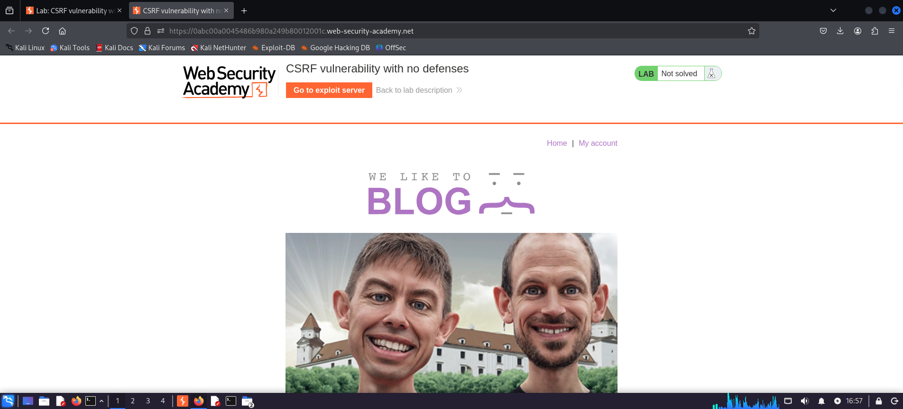
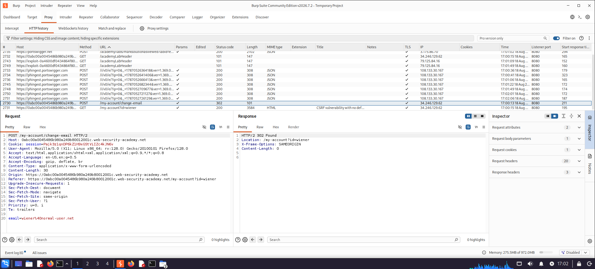
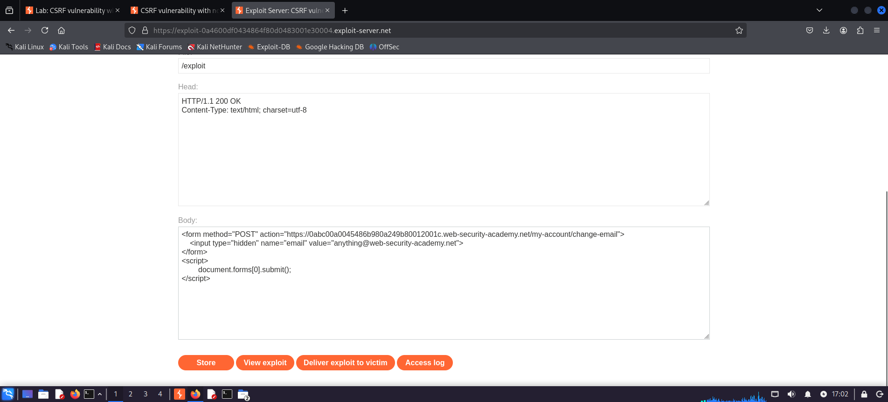
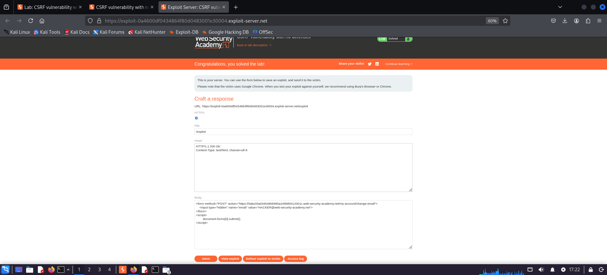

# Cross-Site Request Forgery (CSRF)

## Lab Overview

| Field | Details |
|---|---|
| Platform | PortSwigger Web Security Academy |
| Project Section | Lab 5 |
| Vulnerability | Cross-Site Request Forgery (CSRF) |
| Testing Tool | Burp Suite / Web Browser |
| Difficulty | Apprentice |
| Evidence Screenshots | 4 |
| Status | Completed |

---

## 1. Objective

The objective of this laboratory was to identify and exploit a **Cross-Site Request Forgery (CSRF)** vulnerability in an intentionally vulnerable web application.

The exercise demonstrates how an application that does not adequately protect state-changing requests may allow an attacker to cause a victim's browser to perform an unauthorized action.

The assessment focused on:

- Reviewing normal application functionality.
- Identifying a state-changing request.
- Capturing and analyzing the request using Burp Suite.
- Identifying the absence or weakness of CSRF protections.
- Creating an attacker-controlled exploit page.
- Delivering the crafted request through the exploit server.
- Validating the resulting unauthorized action.
- Collecting technical evidence.
- Verifying successful laboratory completion.

---

## 2. Vulnerability Description

**Cross-Site Request Forgery (CSRF)** is a web application vulnerability in which an attacker can cause a victim's authenticated browser to submit an unwanted state-changing request to a vulnerable application.

The attack generally relies on the victim already being authenticated to the target application.

A simplified attack flow is:

```text
Victim Authenticated to Application
              |
              v
      Attacker-Controlled Page
              |
              v
       Forged HTTP Request
              |
              v
      Victim's Browser
              |
              v
       Target Application
              |
              v
    Unauthorized State Change
```

CSRF is possible when the application does not sufficiently verify that a state-changing request originated from the legitimate application workflow.

---

## 3. Security Classification

| Attribute | Details |
|---|---|
| Vulnerability | Cross-Site Request Forgery |
| CWE | CWE-352 |
| CWE Name | Cross-Site Request Forgery (CSRF) |
| OWASP Category | A01 – Broken Access Control* |
| Attack Surface | Web Application |
| Testing Method | Request analysis and forged-request validation |
| Authentication | Required for the victim scenario |
| User Interaction | Required in typical CSRF scenarios |

\*OWASP categorization can vary by version and context. CSRF is fundamentally an authorization/request-integrity weakness and should be mapped according to the organization's applicable OWASP version.

---

## 4. Tools Used

- Burp Suite
- Burp Proxy
- Burp Repeater
- Firefox / Web Browser
- PortSwigger Web Security Academy
- Exploit Server
- HTTP / HTTPS

---

## 5. Assessment Methodology

```text
                    Start
                      |
                      v
             Access Application
                      |
                      v
          Establish Normal Behavior
                      |
                      v
        Identify State-Changing Action
                      |
                      v
          Capture Request in Burp
                      |
                      v
       Analyze CSRF Protection Mechanism
                      |
                      v
          Construct Forged Request
                      |
                      v
        Host Request on Exploit Server
                      |
                      v
         Deliver to Victim Browser
                      |
                      v
       Validate Unauthorized Action
                      |
                      v
             Capture Evidence
                      |
                      v
          Verify Lab Completion
                      |
                      v
                     End
```

---

# 6. Testing and Exploitation

## 6.1 Review the Normal Application

The application was first accessed under normal conditions.

The objective was to identify functionality that performed a state-changing operation.

### Evidence



**Evidence:** `L01-E01-Normal-Page.png`

This screenshot establishes the normal application state before testing.

---

## 6.2 Capture the State-Changing Request

The relevant request was captured using Burp Suite.

The request was analyzed to identify the parameter responsible for the state-changing operation and to determine whether an anti-CSRF mechanism was present.

### Evidence



**Evidence:** `L01-E02-update-email-burp-request.png`

This screenshot demonstrates the captured state-changing request.

---

## 6.3 Create the CSRF Exploit

A forged request was constructed and placed on the PortSwigger exploit server.

The exploit was designed to cause the victim's authenticated browser to submit the state-changing request to the target application.

### Evidence



**Evidence:** `L01-E03-add-script-in-exploit-server.png`

This screenshot demonstrates the attacker-controlled exploit hosted on the exploit server.

---

## 6.4 Verify Lab Completion

After the forged request was successfully executed in the laboratory environment, the PortSwigger lab reported successful completion.

### Evidence



**Evidence:** `L01-E04-lab-solved.png`

This screenshot provides proof of successful laboratory completion.

---

# 7. Evidence Summary

| Evidence | Description | Purpose |
|---|---|---|
| `L01-E01-Normal-Page.png` | Normal application page | Establish baseline |
| `L01-E02-update-email-burp-request.png` | State-changing request in Burp Suite | Analyze request and CSRF protection |
| `L01-E03-add-script-in-exploit-server.png` | Forged request hosted on exploit server | Demonstrate CSRF exploit |
| `L01-E04-lab-solved.png` | Successful lab completion | Completion proof |

**Total Evidence: 4 screenshots**

---

# 8. Vulnerability Impact

Successful CSRF exploitation can allow an attacker to cause a victim's authenticated browser to perform actions without the victim intentionally requesting them.

Potential impact includes:

- Unauthorized account changes
- Email address modification
- Password changes in vulnerable workflows
- Unauthorized transactions
- Changes to application settings
- Unauthorized actions performed using the victim's privileges

The actual impact depends on which state-changing operations are vulnerable.

### Demonstrated Impact

In this laboratory, the vulnerable state-changing functionality was successfully triggered through a forged request delivered through the exploit server.

---

# 9. Root Cause Analysis

The root cause of CSRF is insufficient verification that a state-changing request originated from the legitimate application context.

A vulnerable flow can be represented as:

```text
Victim Browser
      |
      | Authenticated Session
      v
Target Application
      ^
      |
Forged Request
from Attacker Page
```

If the application accepts the forged request without sufficient CSRF protection, the action may be executed using the victim's authenticated session.

---

# 10. Remediation Recommendations

## 10.1 Use Anti-CSRF Tokens

Generate a strong, unpredictable CSRF token for state-changing requests.

The server should verify the token before processing the request.

Conceptually:

```text
State-Changing Request
          |
          v
    Validate CSRF Token
          |
     +----+----+
     |         |
   Valid     Invalid
     |         |
     v         v
 Process     Reject
 Request     Request
```

---

## 10.2 Use SameSite Cookies

Configure session cookies with an appropriate `SameSite` attribute.

For example:

```text
SameSite=Lax
```

or, where appropriate:

```text
SameSite=Strict
```

This provides an additional browser-level defense against cross-site requests.

---

## 10.3 Validate Request Origin

For sensitive operations, applications can validate the `Origin` header and, where appropriate, the `Referer` header as an additional security control.

---

## 10.4 Protect All State-Changing Requests

CSRF protection should be applied to all relevant state-changing operations, including:

- POST
- PUT
- PATCH
- DELETE

Applications should not assume that only POST requests require protection.

---

## 10.5 Avoid State Changes Through GET

GET requests should be safe and idempotent.

State-changing actions should not normally be performed through URLs that can be triggered passively.

---

## 10.6 Use Defense in Depth

A robust CSRF defense can combine:

- CSRF tokens
- SameSite cookies
- Origin validation
- Secure session management
- Appropriate request methods
- Reauthentication for highly sensitive actions

---

# 11. OWASP and CWE Mapping

## CWE-352

**Cross-Site Request Forgery (CSRF)**

CWE-352 describes situations where a web application does not sufficiently verify whether a request was intentionally submitted by the user.

## OWASP

CSRF is an authorization and request-integrity issue. Its exact OWASP Top 10 mapping depends on the OWASP version being used. In current application-security practice, CSRF defenses are commonly discussed alongside access-control and authentication/session protections.

---

# 12. Detection Indicators

During authorized security testing, potential CSRF indicators include:

- State-changing requests without CSRF tokens
- Predictable or reusable CSRF tokens
- Sensitive actions accepted without Origin validation
- State-changing GET requests
- Session cookies automatically included with cross-site requests
- Successful execution of forged requests from another origin
- Missing or ineffective SameSite cookie protections

Testing should only be performed against systems where explicit authorization has been obtained.

---

# 13. Defensive Testing Recommendations

Organizations should verify that:

1. Sensitive state-changing requests require valid CSRF protection.
2. CSRF tokens are unpredictable and bound appropriately to the user/session.
3. Tokens are validated server-side.
4. SameSite cookie settings are configured appropriately.
5. Origin validation is considered for sensitive operations.
6. State-changing actions are not unnecessarily exposed through GET requests.
7. CSRF protections are covered by automated regression tests.
8. Highly sensitive actions may require additional user confirmation or reauthentication.

---

# 14. Key Learning Outcomes

This laboratory provided practical experience identifying and exploiting a CSRF vulnerability.

### Technical Learnings

- State-changing HTTP requests are important security testing targets.
- Burp Suite can be used to capture and analyze application requests.
- CSRF attacks rely on the victim's authenticated browser context.
- An attacker-controlled page can be used to construct a forged request.
- Exploit servers can be useful for validating CSRF behavior in a controlled lab.
- Successful exploitation should be supported with reproducible evidence.

### Security Engineering Learnings

- State-changing operations require request-integrity protections.
- CSRF tokens provide a primary application-layer defense.
- SameSite cookies provide useful browser-level defense in depth.
- Origin validation can strengthen protection for sensitive operations.
- Security controls should be validated through regression testing.

---

# 15. Skills Demonstrated

This laboratory demonstrates practical experience with:

- Web application security testing
- CSRF testing
- HTTP request analysis
- Burp Suite Proxy
- Burp Suite Repeater
- Request manipulation
- State-changing request analysis
- Exploit Server usage
- Forged request construction
- Authorization testing
- Vulnerability validation
- Evidence collection
- Impact assessment
- Root cause analysis
- Security remediation
- Technical security documentation

---

# 16. Repository Structure

```text
05-Lab-CSRF/
│
├── README.md
│
└── Evidence/
    ├── L01-E01-Normal-Page.png
    ├── L01-E02-update-email-burp-request.png
    ├── L01-E03-add-script-in-exploit-server.png
    └── L01-E04-lab-solved.png
```

---

# 17. Lab Completion

**Status: Completed**

The CSRF vulnerability was successfully identified, tested, exploited, and validated within the authorized PortSwigger Web Security Academy laboratory environment.

The evidence demonstrates the workflow from normal application behavior through request analysis, exploit construction, and successful lab completion.

---

# 18. Disclaimer

This security testing activity was performed exclusively against the intentionally vulnerable environment provided by PortSwigger Web Security Academy for educational and authorized security-training purposes.

No unauthorized systems, applications, infrastructure, or third-party services were targeted.

The techniques documented in this repository are intended for authorized security testing, education, and defensive security research only.

---

## Author

**Yashdeep Sankhla**

Cybersecurity | Network Security | Web Application Security

GitHub: [@y4shsec](https://github.com/y4shsec)
